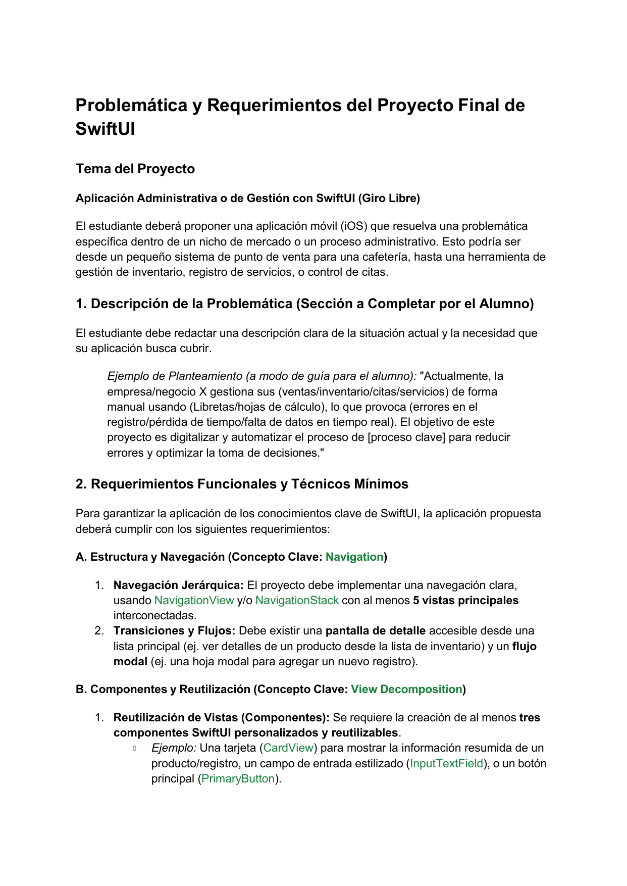
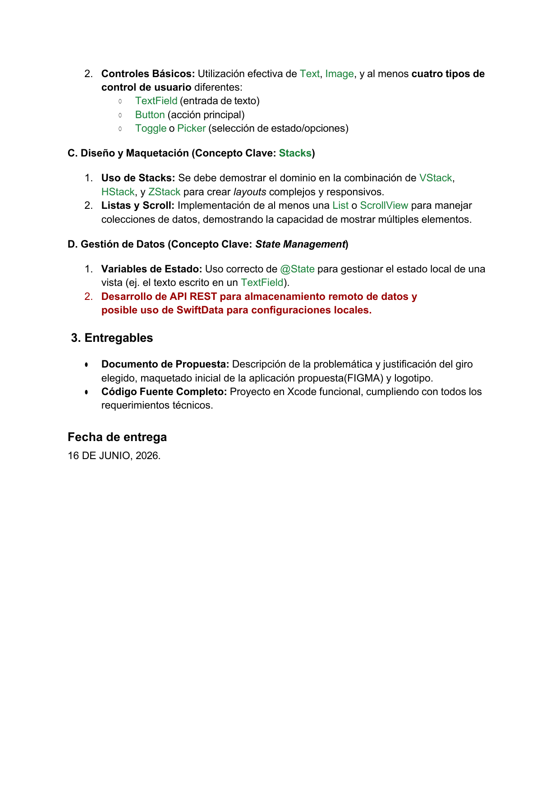

# Borealista - entregable del proyecto

## Problema

Borealista resuelve el control de asistencia academica desde iPhone para dos actores:

- Alumno: consulta sus clases, muestra su identificador digital, revisa faltas y envia justificantes.
- Docente: administra clases, alumnos y justificantes, y toma asistencia desde su celular escaneando el QR de cada alumno.

El problema original era que el flujo estaba partido entre pantallas incompletas, datos mock sin continuidad y un backend parcial. La meta de esta entrega fue cerrar el flujo completo en SwiftUI, con identidad visual consistente y una base de API suficiente para demostrar el proyecto de punta a punta.

## Justificacion de la solucion

Se eligio SwiftUI porque permite construir una app nativa para iPhone 13 Pro con navegacion, estados y componentes reutilizables de forma clara. Tambien se adopto una direccion visual glasslike, minimalista y centrada en el branding de Borealista para elevar la percepcion del producto sin complicar la experiencia.

Del lado de negocio, el sistema aporta tres mejoras directas:

- El alumno puede mostrar un QR generado desde su matricula real.
- El docente puede abrir una clase y tomar asistencia en una ventana de 5 minutos desde la camara del telefono.
- Los justificantes pendientes se revisan dentro del mismo ecosistema sin cambiar de herramienta.

## Identidad visual

Logo oficial usado en la app:


Paleta aplicada en la interfaz:

- `#542C29`
- `#863630`
- `#AD2218`
- `#DB9C98`

## Flujo principal entregado

### Alumno

1. Login / registro
2. Mis clases
3. Detalle de clase
4. Mi identificador QR
5. Mis faltas
6. Envio de justificante
7. Confirmacion de justificante
8. Perfil

### Docente

1. Login
2. Mis clases
3. Detalle de clase
4. Nueva clase
5. Ajustes de clase
6. Editor de horario
7. Gestion de alumnos del grupo
8. Toma de asistencia por QR
9. Justificantes pendientes
10. Perfil

## Evidencia visual de rubrica / mockups

Paginas de referencia renderizadas desde el documento de rubrica:




## Backend local incluido

Se agrego un backend local dentro de `backend/` con las rutas necesarias para:

- login y registro
- consulta de cursos
- registro de asistencia
- justificantes
- QR por matricula
- grupos y alumnos
- clases del docente
- ventana de asistencia de 5 minutos

Base local:

```text
http://localhost:8080/BorealistaAPI/api
```

## Nota para iPhone fisico

Si la app se corre en un iPhone real usando el backend local de la Mac, solo hay que apuntar `BOREALISTA_API_BASE_URL` en `Borealista/Info.plist` a la IP local del equipo.
